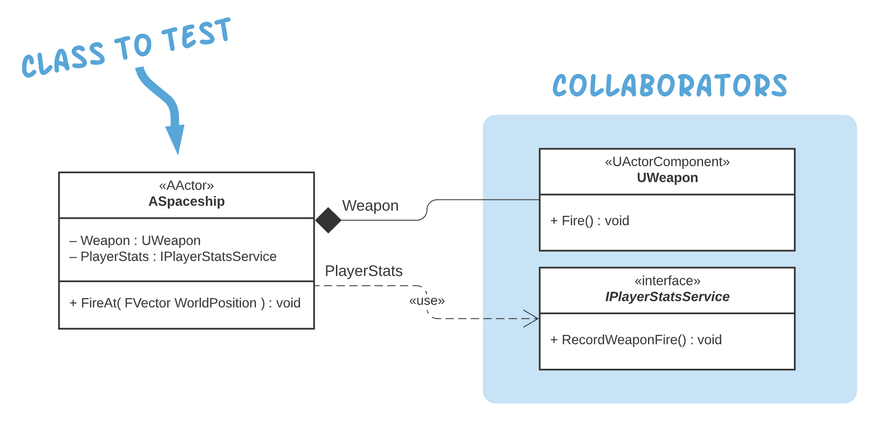
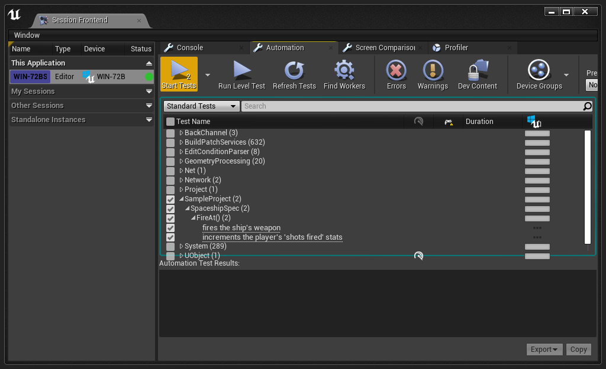

# Unreal Engine GMock Sample Project

This repository contains a simple reference project demonstrating how to incorporate mock objects into your Unreal Engine automated tests using GMock.

## Welcome

A mocking framework can be invaluable when implementing unit tests. The good news is that Unreal Engine ships with a **GoogleTest** module which includes GMock, a powerful mocking library. Unfortunately, GMock's functionality isn't compatible with the UE Automation Testing framework out of the box. Luckily, this incompatibility can be remedied easily using the GoogleTest module's extensibility features. I've done that work so you don't have to.

### Documentation Overview

The first section, [Using GMock in Your Own Projects](#using-gmock-in-your-own-projects), describes how to add GMock support to your own projects. This information is complete and useful even if you don't plan to spend time examining the sample project itself.

The second section, [Exploring the Sample Project](#exploring-the-sample-project), provides additional detail about the sample project itself. If you're new to mocking or the GMock library, this section should provide you with a gentle introduction.

## Using GMock in Your Own Projects

### Setup

**Step 1:** Copy-paste the "GMockAdapter" plugin from this repository (`SampleProject/Plugins/GMockAdapter`) to the "Plugins" folder of your own project. (If your project doesn't already contain a "Plugins" folder, create one.)

**Step 2:** Add the "GoogleTest" and "GMockAdapter" modules as private dependencies for the module you plan to test. For example, if you are adding tests to your project's main module, you would include the following line of code in your `<MyProject>.Build.cs` file:

```
PrivateDependencyModuleNames.AddRange(new string[] { "GoogleTest", "GMockAdapter" });
```

*See [SampleProject/Source/SampleProject/SampleProject.Build.cs](SampleProject/Source/SampleProject/SampleProject.Build.cs) for an example.*

**Step 3:** Open your project in the Unreal Engine Editor. If prompted, choose to compile the missing modules.

**Step 4:** Enable the "Functional Testing" plugin (`Edit > Plugins`). Restart the editor when prompted.

That's it! You're now ready to start using mocks.

### Implementing Mocks

Before you can write a test that uses mock objects you must implement those mocks. Mocks are created by subclassing an existing class or implementing an existing interface. GMock makes this incredibly easy.

For an example of how to create a mock based on a regular C++ *class*, *struct*, or *interface*, see [SampleProject/Source/SampleProject/Tests/Mocks/**MockPlayerStatsService.h**](SampleProject/Source/SampleProject/Tests/Mocks/MockPlayerStatsService.h)

For an example of how to create a mock based on a class that extends Unreal's `UObject` (including `AActor` and others), see [SampleProject/Source/SampleProject/Tests/Mocks/**MockWeapon.h**](SampleProject/Source/SampleProject/Tests/Mocks/MockWeapon.h)

### Writing Tests

When writing tests that use GMock you must be sure to call the following method once before any of your tests run. If you're writing tests using the UE [Automation Spec](https://docs.unrealengine.com/4.27/en-US/TestingAndOptimization/Automation/AutomationSpec/) style (as this project does), putting this code in a top-level `BeforeEach()` method is a good option. 

```
#include "GMockAdapter/Public/GMockAdapter.h"
…
GMockAdapter::Enable();
```

> **Note:** This does *not* have to be called before *every* test. The only requirement is that it be called once before any tests execute. Calling it more than once has no negative effect.

Below is a condensed excerpt from the [***ASpaceship.spec.cpp***](SampleProject/Source/SampleProject/Tests/ASpaceship.spec.cpp) file demonstrating how to use mocks in a test. See the fully commented source file for a more complete version.

```
ASpaceship* Ship;
UMockWeapon* MockWeapon;
FMockPlayerStatsService* MockPlayerStatsService;

BeforeEach([this]()
{
    GMockUEAdapter::Enable();

    MockWeapon = NewObject<UMockWeapon>();
    MockPlayerStatsService = new FMockPlayerStatsService();
    Ship = ASpaceship::Create(MockWeapon, MockPlayerStatsService);
});

Describe("FireAt()", [this]()
{
    It("fires the ship's weapon", [this]()
    {
        EXPECT_CALL(*MockWeapon, Fire())
            .Times(Exactly(1));

        Ship->FireAt(FVector());

        Mock::VerifyAndClearExpectations(MockWeapon);
    });
});
```

For more examples of how to use GMock, see the following wonderful guides from Google:

[Mocking for Dummies](https://google.github.io/googletest/gmock_for_dummies.html)

[Mocking Cookbook](https://google.github.io/googletest/gmock_cook_book.html)

[Mocking Cheat Sheet](https://google.github.io/googletest/gmock_cheat_sheet.html)


------


## Exploring the Sample Project

### Project Overview

The sample project includes this simple class structure:



The project includes unit tests that validate the behavior of the **ASpaceship** class. Specifically, the tests check whether the following expectations have been met:

> When calling `ASpaceship::FireAt()` it should fire the ship's weapon.

> When calling `ASpaceship::FireAt()` it should increment the player's "weapon fire" stat.

Our tests use mock implementations of both the **UWeapon** class and the **IPlayerStatsService** interface. Mocks provide a few important benefits to our little project:

- Mocks allow us to isolate the ASpaceship class from potential flaws in the implementation of its collaborators. 
- Mocks allow ASpaceship to be tested even if its collaborators haven't been fully implemented. Case-in-point: this project includes no concrete implementation of the IPlayerStatsService interface.
- Mocks provide a mechanism for us to "spy" on the runtime calls that ASpaceship makes to its collaborators. 

In more robust real-world projects mocks also offer:

- A way to intentionally trigger error conditions
- Control over return values from collaborator methods
- Fast test execution

### Running the Tests

To run the tests…

**Step 1:** Launch the project in the Unreal Engine Editor. If prompted, choose to compile the missing modules ("SampleProject" and "GMockAdapter").

**Step 2:** Open the **Test Automation Window** (`Window > Test Automation`). 

**Step 3**: Select the Automation tab.

**Step 4:** Tick the checkbox next to the "SampleProject" test suite, and click the "Start Tests" button.



### Exploring the Code

Below is an overview of the file structure of the C++ code files. Some files have been omitted for simplicity.

```
📂 SampleProject/
  📂 Plugins/
  	📂 GMockAdapter/   👈 Code that adapts GMock for use in UE
  📂 Source/
    📂 SampleProject/
        📂 Private/    👈 Concrete implementations of our game classes
          📄 Spaceship.cpp
          📄 Weapon.cpp
        📂 Public/     👈 Interfaces for our game classes
          📄 IPlayerStatsService.h
          📄 Spaceship.h
          📄 Weapon.h
        📂 Tests/
          📂 Mocks/    👈 Mock implementations
              📄 MockPlayerStatsService.h
              📄 MockWeapon.h
          📄 Spaceship.spec.cpp   👈 Our ASpaceship test script
        
```

> ✏️ **Note:** This is only one of many approaches to organizing game and test code. Another useful approach is to bundle the test-specific code into its own module.

All of the code in this project has been heavily commented to help explain the implementation. Dive in!
